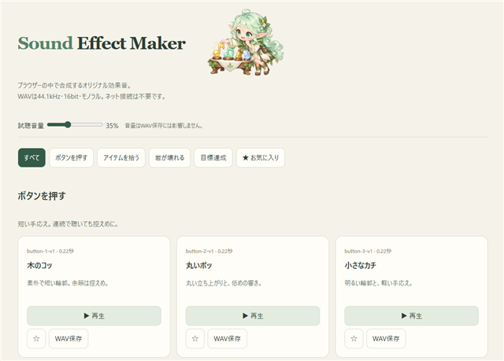

# Sound Effect Maker

欲しい効果音をテキストに書いてCodexに頼むと、音を聴き比べるページを作り、Codex内のブラウザーで開きます。

## 使い方

1. GitHubの「Code → Download ZIP」からダウンロードし、ZIPを展開します。
2. Codexデスクトップアプリで、このフォルダを開きます。
3. `wishes.txt` をメモ帳で開き、欲しい音とイメージを書いて保存します。
4. Codexに「よろしく」と伝えます。必要なら「AGENTS.mdを参照して、wishes.txtの内容でよろしく」と伝えてください。
5. Codexが効果音とHTMLを作り、内蔵ブラウザーに試聴ページを開きます。
6. 音を聴き比べ、気に入った音をWAVで保存します。

利用者が編集するのは `wishes.txt` だけです。日本語で自由に記入できます。`AGENTS.md` はCodex用の指示書です。

Pythonの事前インストールやサーバーの手動起動は前提にしません。プレビューに必要な準備はCodexが利用可能な実行環境を確認して行います。環境や権限の制約で起動できない場合は、その理由を案内します。

## どのブラウザーで開く？

通常はCodex内蔵ブラウザーで開きます。ローカルHTMLの直接表示が制限される環境でも表示できるよう、CodexがPC内のローカルサーバーを起動します。`http://127.0.0.1:...` はその人自身のPCを指し、配布元のPCや公開サイトには接続しません。

**効果音ページ自体にサーバーは不要です。** 完成した `output/sound-candidates.html` をChromeやEdgeで直接開いて、試聴・WAV保存する使い方もできます。ファイルを右クリックして「プログラムから開く」からブラウザーを選んでください。この方法ではサーバーの起動やネット接続は不要です。

Chromeなどで試聴しながら、修正の指示はCodexに出せます。たとえば「Chromeで試聴するので、HTMLを更新して」と伝え、更新が終わったらブラウザーを再読み込みしてください。開いているファイルとCodexが編集するファイルは同じものを使います。コピーしたHTMLは自動では更新されません。

お気に入りはブラウザーや開き方によって保存先が異なり、Codex内ブラウザーからChromeへ自動では引き継がれません。

## 調整と再開

修正は「ボタン音をもっと柔らかく」などとCodexに伝えてください。次回は「試聴ページを開いて」と頼めます。

気になる音には☆を付けられます。お気に入りは同じブラウザーに保存されます（ブラウザーの設定によっては保存できない場合があります）。

## 同梱ファイル

- `wishes.txt`：欲しい効果音とイメージの記入欄。
- `AGENTS.md`：生成からブラウザー表示までのCodex向け指示。
- `assets/`：ヘッダー用エルフ画像とREADMEのプレビュー画像。エルフ画像は完成HTMLにも埋め込みます。
- `output/`：記入例のサンプル。Codexが依頼に合わせて更新します。
- `LICENSE`：ライセンス。

## ライセンス

MIT License。詳細は `LICENSE` を参照してください。
